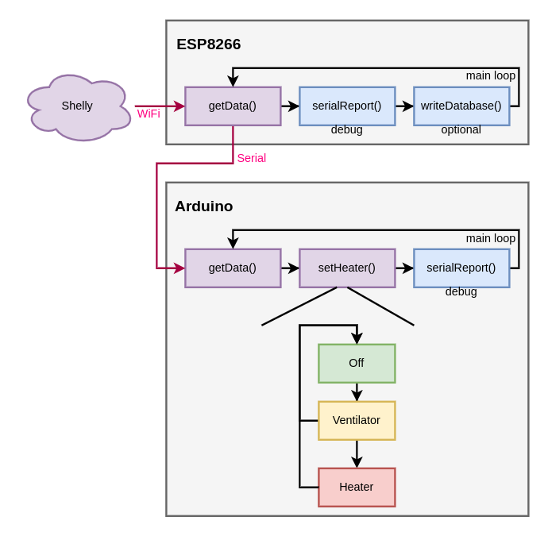
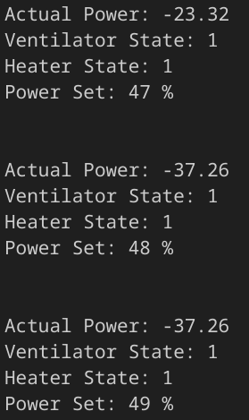

# AC Dimmer for PV self-consumption optimization

This project uses a [Shelly Pro 3EM Smart Meter](https://shelly-api-docs.shelly.cloud/gen2/Devices/Gen2/ShellyPro3EM) to measure the PV "Balkonkraftwerk" overproduction. An [ESP8266](https://www.espressif.com/sites/default/files/documentation/esp8266-technical_reference_en.pdf) fetches the data. The ESP8266 sends the measured power via serial interface to an Arduino. The Arduino then controls a [RobotDyn AC Dimmer](https://github.com/RobotDynOfficial/Documentation/wiki/AC-Light-Dimmer-Module,-1-Channel,-3.3V_5V-logic,-AC-50_60hz,-220V_110V). The output of the AC Dimmer can then be used to power e.g. an electro heater.

In the first version of this project I only used an [ESP32](https://www.espressif.com/sites/default/files/documentation/esp32_datasheet_en.pdf) to do all the work. The system crashed on a regular base. It seems like the AC Dimmer library and the Ethernet stuff doesn`t work all to well together. So I used a [board which contains both Arduino & ESP8266](https://github.com/PaulusElektrus/Arduino_and_ESP) which I had used in other projects already. The ESP does the networking stuff and the Arduino has a simple & therefore safe regulation task.  

## Preliminary Considerations

I thought about building my own dimmer but then I discovered the RobotDyn AC Dimmer Modules. They are cheaper than building it yourself and there is a [library already available on Github](https://github.com/RobotDynOfficial/RBDDimmer). So I decided to "stand on the shoulders of Giants instead of reinventing the wheel" 😉

## Milestones

- [X] Select & Buy Hardware 
- [X] Connect the ESP to the Shelly and fetch data
- [X] Connect the AC Dimmer to the ESP and check functionality
- [X] Programm the control software to use only the overproduction
- [X] Connect everything together
- [X] Tests
- [X] Switched to new architecture -> ESP8266 & Arduino combi board
- [X] Final Tests
- [ ] Add a housing
- [ ] Optional: Add a measurement method and store the data

## Software Overview

## Electro Heater

A 1.5 kW electro heater was the first test device that I want to power with my overproduction. As I am working on this it is winter and warm air is needed. In summer one can think about replacing the electro air heater with a heating blade for a water boiler. (This is more complicated to install because I have no experiences with plumbing work.) 

While testing the air heater I realized that I need min. 400W so that the fan starts spinning. I decided to decouple the fan from the heating resistors. So now I have to plugs: One only for the fan and one for the rest of the device. 

### Energy Consumption

The electric heater consists of:

- Fan: Min. 20 W
- Resistors: Stage 1: Max: 700W, Stage 2: Max: 1500 W

So the software should start the fan at 20 W overproduction and then the AC dimm can start the heating resistors. Perhaps a threshold of a minimum (10 W) feed-in would be useful to avoid electricity costs at all. The switch of the electric heater shall be set to On and only Stage 1 shall be activated.

## Shelly API

I did already a Shelly data readout in my [Shelly3EM_to_InfluxDB](https://github.com/PaulusElektrus/Shelly3EM_to_InfluxDB/tree/master) Repo, see [this file](https://github.com/PaulusElektrus/Shelly3EM_to_InfluxDB/blob/master/src/main.cpp). Funny to see my progress since these beginnings. The old code definitifely needs a rework...

To get the data from Shelly device simply use the rpc endpoint with a http client: `http://shelly_ip_address/rpc/EM.GetStatus?id=0`

You will get a response in json format. This needs to be unpacked to get the raw values.

## Regulation

The regulation loop is very simple and only based on thresholds. The Shelly sends updated values every ~500msec. So the regulation loop is adapted to this speed. 

It turns out that the regulation works very well and the system is always around ~-10 W.

## Debug 

Debugging via the serial console is controlled by Makros:

- Debug Off:    `#undef     DEBUG_MODE`
- Debug On:     `#define    DEBUG_MODE`

You will get a serial report with the current state & output, e.g. for the Arduino:

